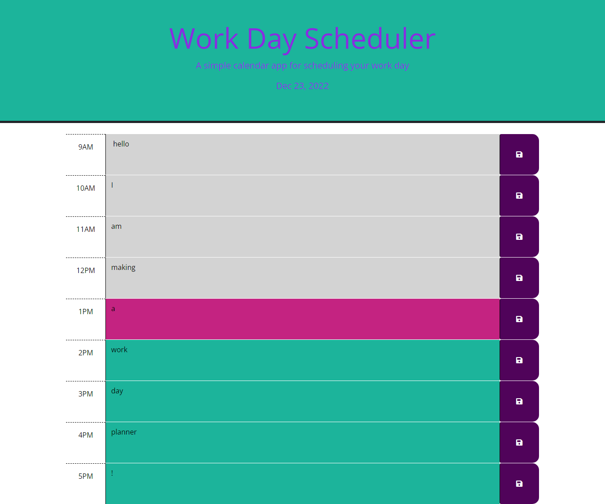

# Work Day Scheduler

## Description 
An application developed to help busy people schedule their work day from 9am-5pm. Past hours are colored red, current is colored pink, and future is colored teal. Each hour can have events scheduled into it from individual users. The events will persist even after refreshing page as long as local storage is not cleared.

## Screenshot

## Deployed Application URL
https://brennaveir.github.io/work-day-scheduler/